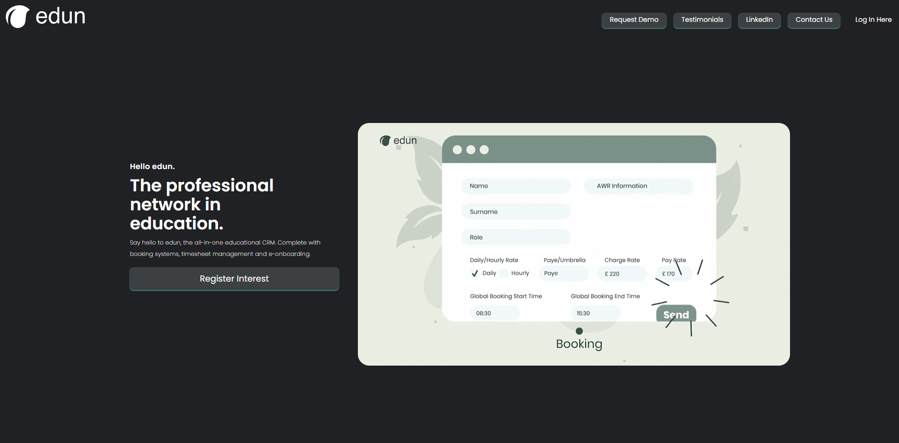

# cosmic-wind-proto
A small Next.JS prototype for Edun, converting the first landing page into a dark-mode version.
I've taken the logo and the video from the main page, but the rest has been created by eye.

# Build / running
npm install to download the required dependencies
npm run dev to start the development server

# Layout
I've included a screenshot of the progress so far below, which is by no means the finished product!

# TODO for this project:
- Abstract in-line tailwind into globals.css for repeated use-cases
- Decide on highlight color accent for enhanced accessibilty
- Refactor HTML to be more semantic
- Perhaps most important - make it responsive!

Thanks for taking a look!